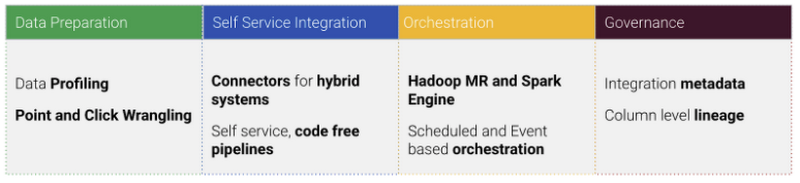
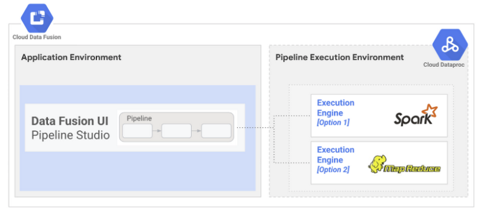

# Cloud Data Fusion

## What is Cloud Data Fusion?

Cloud Data Fusion is a GUI based data integration service for building and managing data pipelines. It is based on [CDAP](https://github.com/cdapio/cdap), which is an open source framework for building data analytics applications for on-premise and cloud sources. It provides a wide variety of out of the box connectors to sources on GCP, other public clouds and on-premise sources.

## What can you do with Data Fusion?

In addition to the capability to create code free GUI based pipelines, Data Fusion also provides features for visual data profiling and preparation, simple orchestration features, as well as granular lineage for pipelines.

## What sits under the hood?

Under the hood, Data Fusion executes pipelines on a [Dataproc](https://cloud.google.com/dataproc) cluster. Data Fusion automatically converts GUI based pipelines into Dataproc jobs for execution whenever a pipeline is executed. It supports two execution engine options: MapReduce and Apache Spark.

